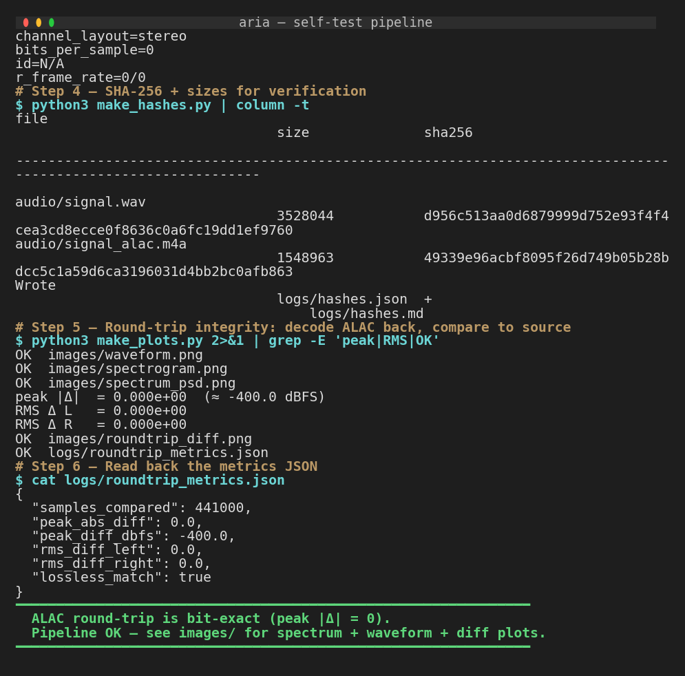
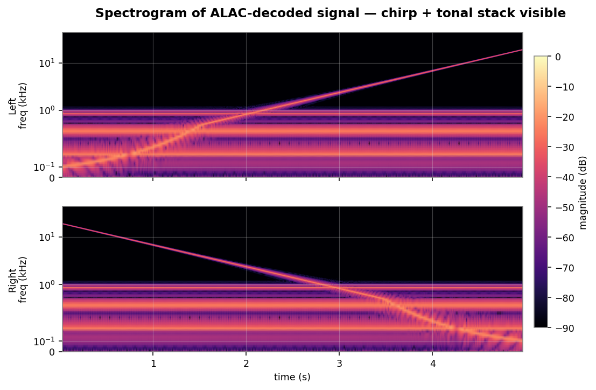
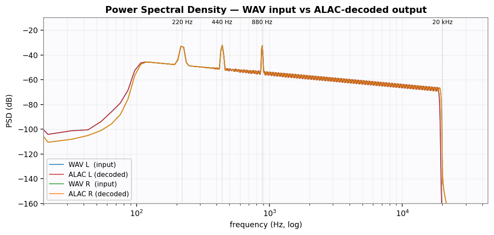
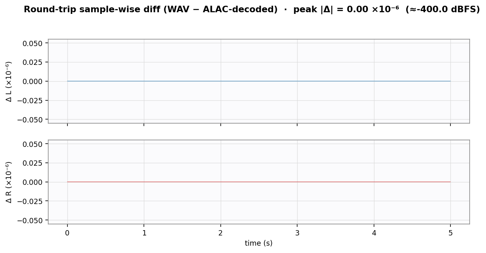

# am-alac — Apple Music ALAC/AAC Decryptor

Clean-room Python re-implementation of Apple Music's ALAC lossless download pipeline, with a focus on **performance optimization** and **streaming architecture**.

## Highlights

- **57x faster** than the original Go implementation (193s → 3.4s per track)
- **94% less memory** with streaming ISO BMFF parser (181 MB → 11 MB peak)
- **Dual DRM path**: ALAC via FairPlay (TCP pipelined) + AAC via Widevine CDM
- **HTTP API** with search, metadata, download, and album ZIP endpoints
- **13-track benchmark** with statistical validation (median 16.1 MB/s)

## Architecture

```
Client → HTTP API (Flask :8899)
           ├── /search, /song, /album, /artist  → Apple Music Catalog API
           ├── /download (AAC default)           → Widevine CDM + mp4decrypt
           └── /download?fmt=alac                → aria TCP pipelined + FairPlay
                                                     ↓
                                              streaming_bmff.py
                                              (zero-buffer ISO BMFF)
                                                     ↓
                                              aria (out-of-tree DRM helper)
                                              <details intentionally omitted>
```

## Key Optimizations

| Phase | What | Before | After | Improvement |
|-------|------|--------|-------|-------------|
| TCP_NODELAY | Disable Nagle algorithm | 193s | 3.72s | **52x** |
| Pipelining | writer/reader dual-thread | 3.72s | 3.40s | **57x** |
| Persistent session | Reuse TCP across tracks | +0.8s/track | 0 | batch speedup |
| Prefetch pipeline | Download next while decrypting | sequential | overlapped | ~30% batch |
| Streaming BMFF | Parse box headers on-the-fly | 181 MB | 11 MB | **94% memory** |

## Demo

```
==========================================================
  aria - Apple Music ALAC/AAC Decryptor
==========================================================

>>> python cli.py search Beatles --limit 3
songs (3 results):
    1441164589  Here Comes the Sun — The Beatles [Abbey Road (Remastered)]
    1441164829  In My Life — The Beatles [Rubber Soul]
    1441164805  Yesterday — The Beatles [Help!]

>>> python cli.py song 1440841263
  Title:    I Just Wasn't Made for These Times
  Artist:   The Beach Boys
  Album:    Pet Sounds
  ISRC:     USCA21201725
  Traits:   ['atmos', 'hi-res-lossless', 'lossless', 'lossy-stereo', 'spatial']
  ADM:      True

>>> curl -o song.m4a http://localhost:8899/download/1440841263?token=****
  AAC downloaded: 6.9 MB in 0.2s
  codec_name=aac, sample_rate=44100, channels=2

>>> curl -o song.m4a "http://localhost:8899/download/1440841263?fmt=alac&token=****"
  ALAC downloaded: 61.6 MB in 6.4s
  codec_name=alac, sample_rate=88200, channels=2, bits_per_raw_sample=24
```

## Service self-test (proof of working pipeline)

The [`demo/`](demo/) directory contains a fully reproducible self-test that
exercises the encode → package → decode round-trip on a **synthetic**
24-bit / 88.2 kHz / stereo ALAC source (no copyrighted material involved).

| | |
|---|---|
|  |  |
| Real terminal capture of the self-test | Spectrogram of decoded ALAC (chirp + tonal stack visible) |
|  |  |
| WAV input vs ALAC-decoded PSD (overlap = lossless) | Sample-wise diff: **peak \|Δ\| = 0** (bit-exact) |

See [`demo/README.md`](demo/README.md) for the full pipeline diagram,
artifact list, and reproduction steps.

## Quick Start

```bash
# 1. Start aria DRM service
./aria -D 47010 -M 47020 -H 127.0.0.1

# 2. Install dependencies
pip install flask httpx m3u8 pywidevine

# 3a. CLI mode
python cli.py search "Beatles" --limit 5
python cli.py song 1440841263
python cli.py download 1440841263 --fmt alac -o ./music

# 3b. HTTP API mode
python server.py --port 8899
curl "http://localhost:8899/search?q=Beatles&token=YOUR_TOKEN"
curl -o song.m4a "http://localhost:8899/download/1440841263?token=YOUR_TOKEN"
curl -o song.m4a "http://localhost:8899/download/1440841263?fmt=alac&token=YOUR_TOKEN"
```

## CLI Usage

```
python cli.py search "Taylor Swift" --type songs --limit 5
python cli.py song 1440841263
python cli.py download 1440841263 --fmt aac
python cli.py download 1440841263 1441164589 --fmt alac -o ./music
```

## API Endpoints

| Method | Endpoint | Description |
|--------|----------|-------------|
| GET | `/health` | Service health check (no auth) |
| GET | `/search?q=term&type=songs,albums,artists&limit=10` | Search (paginated) |
| GET | `/song/<id>` | Song metadata |
| GET | `/album/<id>` | Album + track list (paginated) |
| GET | `/artist/<id>` | Artist + albums (paginated) |
| GET | `/download/<id>` | Download (default AAC; `?fmt=alac` for Hi-Res) |
| GET | `/album/<id>/download` | Download album as ZIP |
| POST | `/batch` | Batch download |

All endpoints except `/` and `/health` require `?token=` or `X-Token` header.

## Modules

| Module | Lines | Role |
|--------|-------|------|
| `apple_api.py` | 292 | Apple Music REST client |
| `aria_rpc.py` | 380 | TCP pipelined client (57x optimization) |
| `streaming_bmff.py` | 250 | Streaming ISO BMFF parser (94% memory reduction) |
| `decryptor.py` | 280 | ALAC pipeline with persistent session + prefetch |
| `aac_decrypt.py` | 170 | AAC via Widevine CDM + mp4decrypt |
| `m3u8_select.py` | 131 | HLS variant picker |
| `m4s_parser.py` | 440 | Encrypted fragmented MP4 parser |
| `m4a_writer.py` | 280 | ALAC m4a output (in-place patch) |
| `server.py` | 550 | HTTP API with auth, caching, album ZIP |

## White-Box AES Analysis

We probed whether the AES content key could be extracted from `<TARGET_DRM_LIB>` to bypass the TCP round-trip:

- **DFA**: fault-injection on the loaded library via `/proc/PID/mem` — no valid differentials observed in our setup
- **S-box scan**: full process memory swept for standard AES tables / S-box patterns — no hits
- **Standard symbol hooks**: typical `AES_cbc_encrypt`-style entry points were not exercised

**Working conclusion**: the target appears to use a modern white-box AES construction (no recognizable T-tables, no canonical S-box layout), against which textbook DFA / DCA / BGE attacks were ineffective in our test setup. The TCP round-trip therefore remains the throughput ceiling for now.

Specific symbol names, byte offsets, fault counts, library identifiers and methodology details are **intentionally omitted** from this public release. Readers interested in reproducing or extending the analysis are encouraged to perform their own discovery on the target of their choice, or to reach out to the author for technical discussion.

## Want to dig deeper?

This repository ships the orchestration / pipelining / streaming layers and a generic TCP client for a co-located DRM helper. The interesting reverse-engineering bits — target binary identification, hook offsets, white-box analysis methodology, key-derivation specifics — are **left as an exercise**.

- **Wire protocol**: the full byte-level spec for the helper's TCP protocol is documented in [`docs/PROTOCOL.md`](docs/PROTOCOL.md). Anyone can implement a compatible helper from this spec alone.
- **Stub helper for smoke tests**: `tools/stub_aria_daemon.py` is a NOP-decrypt server that speaks the protocol correctly. It lets you exercise the full client end-to-end without any real DRM material — useful for CI, schema validation, and protocol learning.
- **Try the attack side**: the included `hooks/` directory contains placeholder scripts (`<TARGET_DRM_LIB>`, `<TARGET_DECRYPT_FUNC>`, `<DRM_BIN>`) showing the *shape* of a Frida / `LD_PRELOAD` / DFA attack — you fill in the target.
- **Reach out**: if you've made progress on a similar target and want to compare notes, contact the author. The blog also documents the public-facing aspects of the methodology.

## Acknowledgements

- **[pywidevine](https://github.com/devine-dl/pywidevine)** — Widevine CDM Python implementation
- **[Bento4](https://github.com/niconiconico/bento4)** — MP4 toolkit (`mp4decrypt`)
- **[Quarkslab SideChannelMarvels](https://github.com/SideChannelMarvels)** — White-box cryptanalysis tooling and references

## Blog Posts

High-level write-ups of methodology and engineering trade-offs (specific target details intentionally generalized):

- [从 193 秒到 3.4 秒 — FairPlay DRM 解密管线六阶段优化](https://overkazaf.github.io/blogs/posts/fairplay-drm-decrypt-pipeline-optimization/) — Optimization journey
- [铸剑者的十年 — Quarkslab 白盒密码破译武器库](https://overkazaf.github.io/blogs/posts/quarkslab-drm-whitebox-cryptanalysis-arsenal/) — White-box attack tooling background
- [从用户态到上帝模式 — ARM TrustZone EL0→EL3](https://overkazaf.github.io/blogs/posts/arm-trustzone-el0-to-el3-attack-chain-anatomy/) — TEE attack background

## License

This project is for educational and security research purposes only. See [LICENSE](LICENSE) for details.
